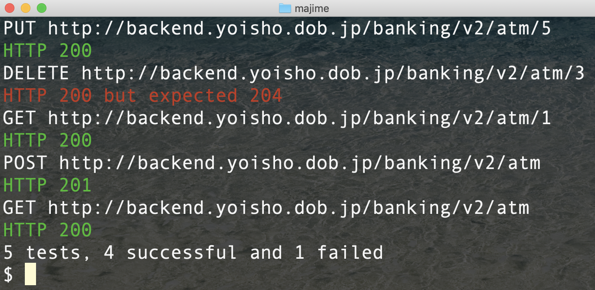

/ma-ji-me/

*noun*

1. an earnest, reliable person who can get things done
2. dead simple API Unit Testing

## What does it do?

* majime runs test cases on API endpoints
* test cases are defined in YAML files
* majime can generate test cases from Swagger specs

## Install

`pip install majime` in a Python3 environment

Or get the binaries for [MacOS](https://github.com/u1i/majime/raw/master/releases/majime-darwin-386.zip) | [Linux](https://github.com/u1i/majime/raw/master/releases/majime-linux-amd64.zip) | Windows

[Package on Pypi](https://pypi.org/project/majime/)

## Usage

    Usage:

     -f Load and run tests from YAML file
        Example: majime -f test.yaml
     -g Generate test suite (YAML) from Swagger document
        Example: majime -g http://api.example.com/swagger.json

    Switches:

     -j JSON output
     -d Dry-Run, do not execute tests - good for testing your YAML file

## Example

#### Generate Test Cases from Swagger

`majime -g http://backend.yoisho.dob.jp/fx/swagger`

    Title: Yoisho Currency Exchange
    Host: backend.yoisho.dob.jp
    Base Path: /fx
    Scheme: http
    Path: /currency
		Method: GET
		Description: Get the FX rate for desired currency
		Query Parameters: ['currency']
		Expected Response: 200

##### Generated Output File

    Base: "http://backend.yoisho.dob.jp/fx"
    Tests:
     # GET - Get the FX rate for desired currency
     - path: "/currency?currency=USD"
       method: "GET"
       headers: ""
       expect-response: "200"
       expect-body: "json"

#### Run Test Cases

Modify the parameters so they make sense, in this case XXX-> USD.

`majime -f Yoisho_Currency_Exchange-*.yaml`

    GET http://backend.yoisho.dob.jp/fx/currency?currency=USD
	HTTP 200

Check out the [examples](./example).
